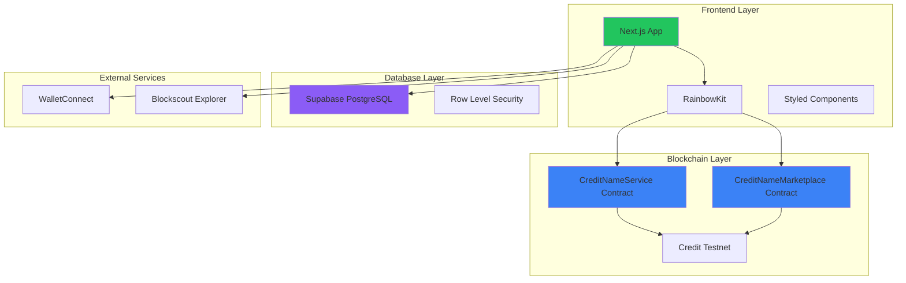
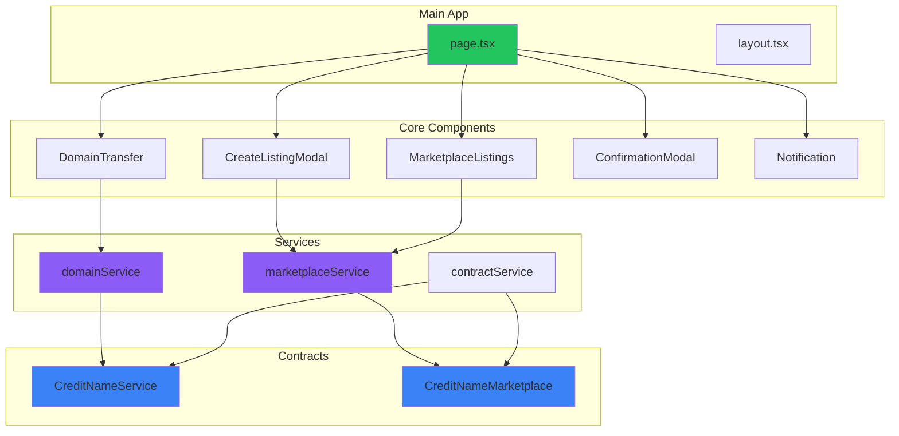

# Credit Name Service - Architecture Overview

## System Architecture

```mermaid
graph TB
    subgraph "Frontend Layer"
        UI[Next.js App]
        RK[RainbowKit]
        SC[Styled Components]
    end
    
    subgraph "Blockchain Layer"
        CNS[CreditNameService Contract]
        CMP[CreditNameMarketplace Contract]
        CT[Credit Testnet]
    end
    
    subgraph "Database Layer"
        SB[Supabase PostgreSQL]
        RLS[Row Level Security]
    end
    
    subgraph "External Services"
        WC[WalletConnect]
        BE[Blockscout Explorer]
    end
    
    UI --> RK
    UI --> SB
    RK --> CNS
    RK --> CMP
    CNS --> CT
    CMP --> CT
    UI --> WC
    UI --> BE
    
    style UI fill:#22c55e
    style CNS fill:#3b82f6
    style CMP fill:#3b82f6
    style SB fill:#8b5cf6
```

## Component Architecture

```mermaid
graph TD
    subgraph "Main App"
        APP[page.tsx]
        LAYOUT[layout.tsx]
    end
    
    subgraph "Core Components"
        DT[DomainTransfer]
        CLM[CreateListingModal]
        ML[MarketplaceListings]
        CM[ConfirmationModal]
        NOT[Notification]
    end
    
    subgraph "Services"
        DS[domainService]
        MS[marketplaceService]
        CS[contractService]
    end
    
    subgraph "Contracts"
        CNS[CreditNameService]
        CMP[CreditNameMarketplace]
    end
    
    APP --> DT
    APP --> CLM
    APP --> ML
    APP --> CM
    APP --> NOT
    
    DT --> DS
    CLM --> MS
    ML --> MS
    
    DS --> CNS
    MS --> CMP
    CS --> CNS
    CS --> CMP
    
    style APP fill:#22c55e
    style DS fill:#8b5cf6
    style MS fill:#8b5cf6
    style CNS fill:#3b82f6
    style CMP fill:#3b82f6
```