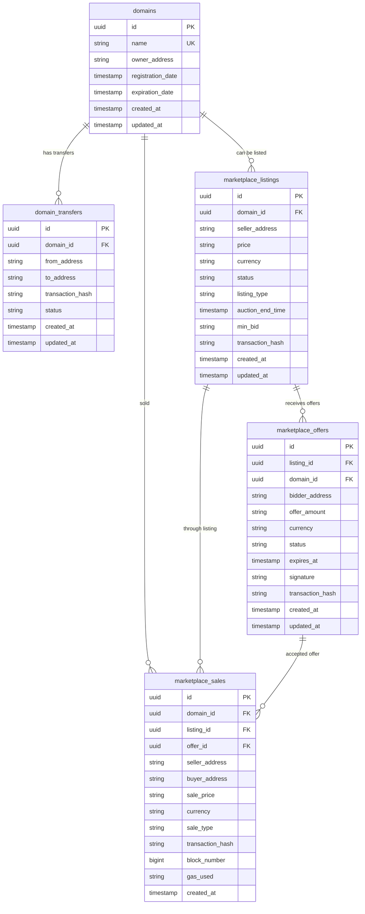
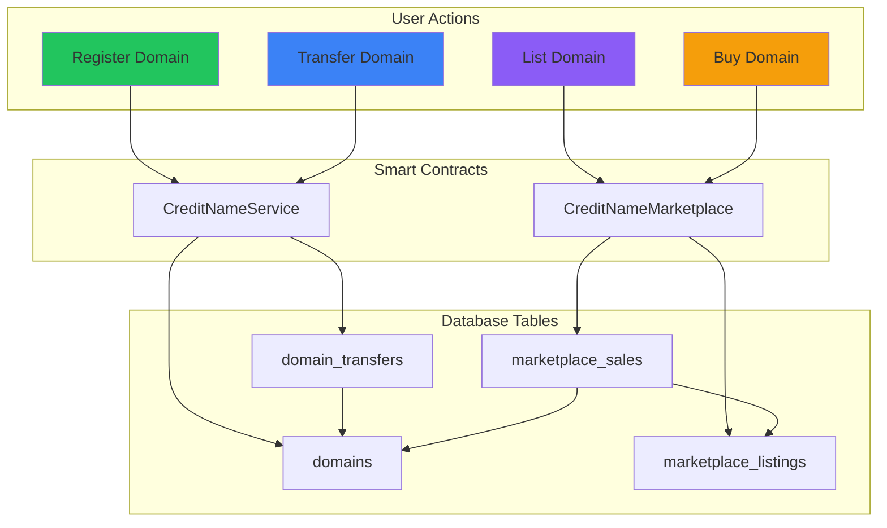

# Credit Name Service - Database Schema

## Entity Relationship Diagram

```mermaid
erDiagram
    domains {
        uuid id PK
        string name UK
        string owner_address
        timestamp registration_date
        timestamp expiration_date
        timestamp created_at
        timestamp updated_at
    }
    
    domain_transfers {
        uuid id PK
        uuid domain_id FK
        string from_address
        string to_address
        string transaction_hash
        string status
        timestamp created_at
        timestamp updated_at
    }
    
    marketplace_listings {
        uuid id PK
        uuid domain_id FK
        string seller_address
        string price
        string currency
        string status
        string listing_type
        timestamp auction_end_time
        string min_bid
        string transaction_hash
        timestamp created_at
        timestamp updated_at
    }
    
    marketplace_offers {
        uuid id PK
        uuid listing_id FK
        uuid domain_id FK
        string bidder_address
        string offer_amount
        string currency
        string status
        timestamp expires_at
        string signature
        string transaction_hash
        timestamp created_at
        timestamp updated_at
    }
    
    marketplace_sales {
        uuid id PK
        uuid domain_id FK
        uuid listing_id FK
        uuid offer_id FK
        string seller_address
        string buyer_address
        string sale_price
        string currency
        string sale_type
        string transaction_hash
        bigint block_number
        string gas_used
        timestamp created_at
    }
    
    domains ||--o{ domain_transfers : "has transfers"
    domains ||--o{ marketplace_listings : "can be listed"
    marketplace_listings ||--o{ marketplace_offers : "receives offers"
    domains ||--o{ marketplace_sales : "sold"
    marketplace_listings ||--o{ marketplace_sales : "through listing"
    marketplace_offers ||--o{ marketplace_sales : "accepted offer"
```

## Data Flow Diagram

```mermaid
flowchart TD
    subgraph "User Actions"
        REG[Register Domain]
        TRANS[Transfer Domain]
        LIST[List Domain]
        BUY[Buy Domain]
    end
    
    subgraph "Smart Contracts"
        CNS[CreditNameService]
        CMP[CreditNameMarketplace]
    end
    
    subgraph "Database Tables"
        DOM[domains]
        DT[domain_transfers]
        ML[marketplace_listings]
        MS[marketplace_sales]
    end
    
    REG --> CNS
    CNS --> DOM
    
    TRANS --> CNS
    CNS --> DT
    DT --> DOM
    
    LIST --> CMP
    CMP --> ML
    
    BUY --> CMP
    CMP --> MS
    MS --> DOM
    MS --> ML
    
    style REG fill:#22c55e
    style TRANS fill:#3b82f6
    style LIST fill:#8b5cf6
    style BUY fill:#f59e0b
```