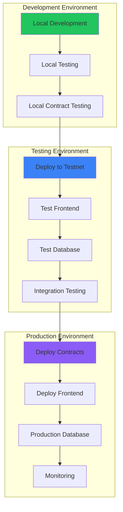
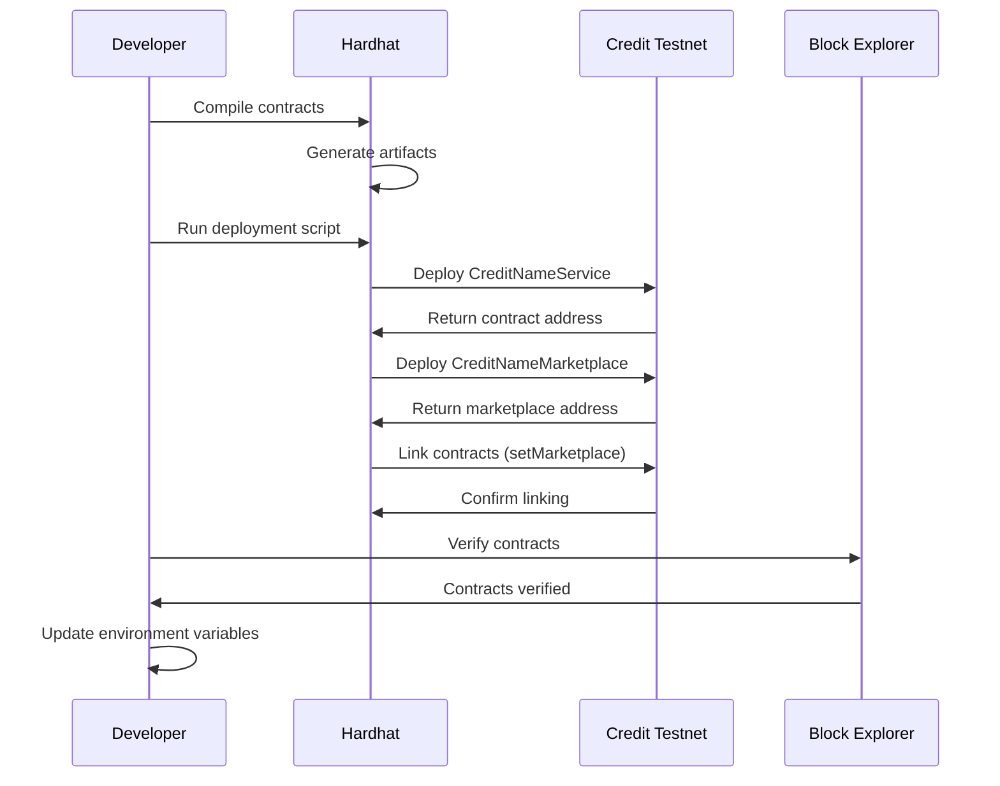
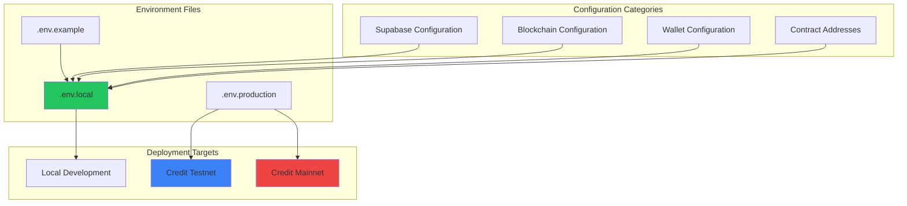
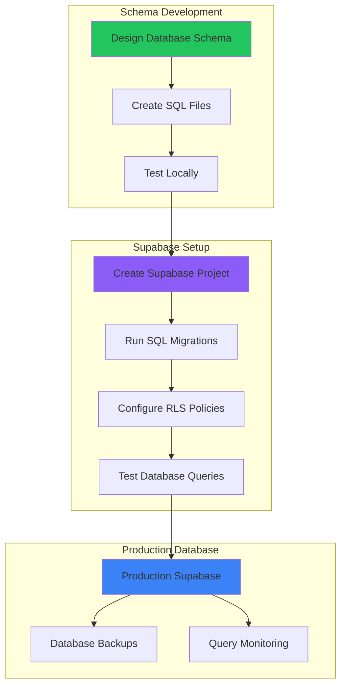
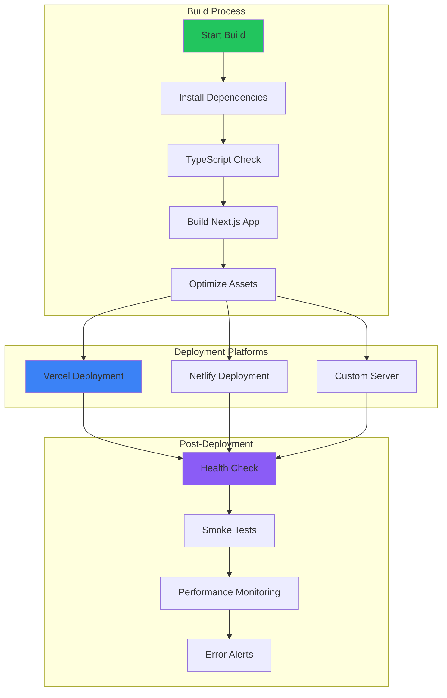

# Credit Name Service - Deployment Flow

## Development to Production Pipeline

## Smart Contract Deployment Process

## Environment Configuration

## Database Migration Flow

## Frontend Deployment Pipeline

