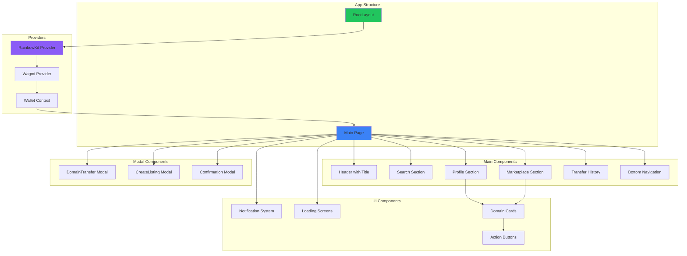
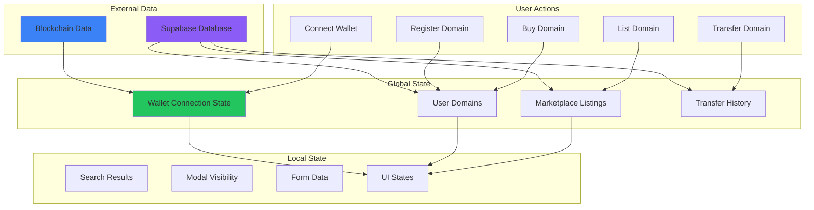
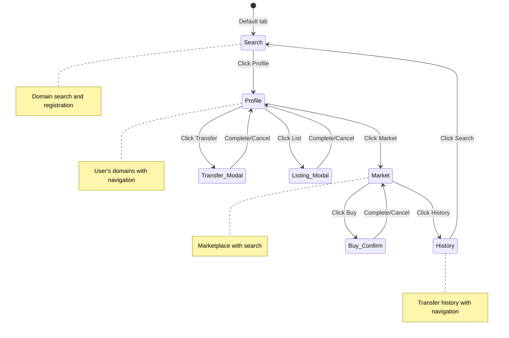
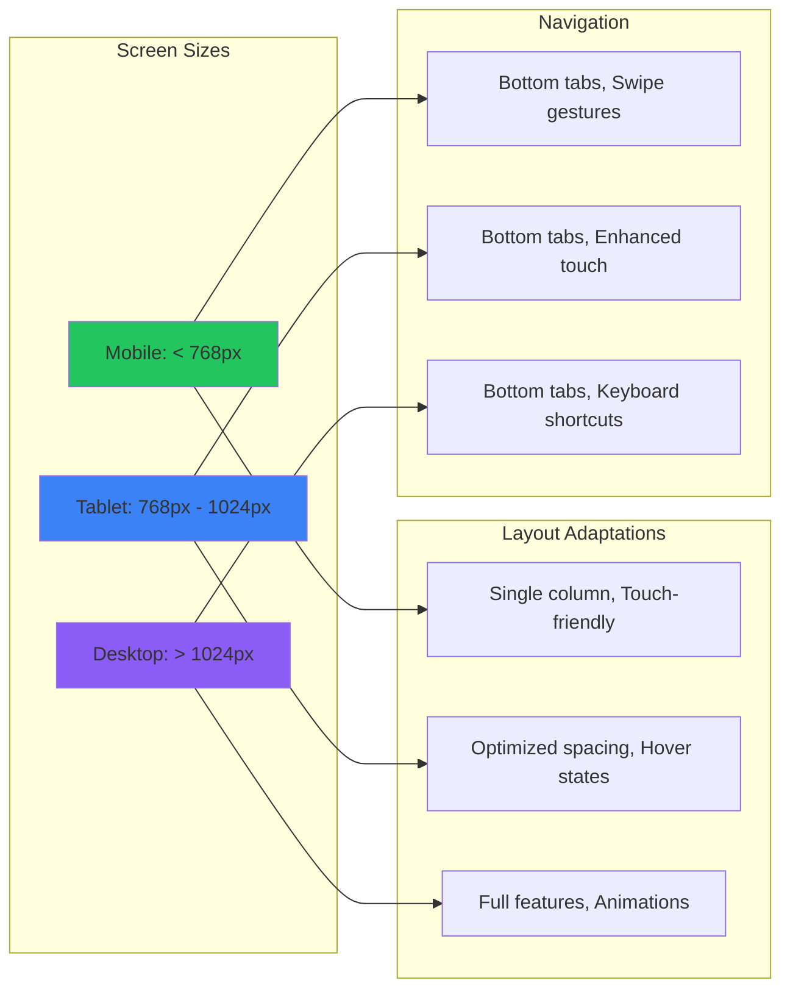

# Credit Name Service - Frontend Architecture

## Component Hierarchy

```mermaid
graph TD
    subgraph "App Structure"
        ROOT[RootLayout]
        PAGE[Main Page]
    end
    
    subgraph "Providers"
        RAINBOW[RainbowKit Provider]
        WAGMI[Wagmi Provider]
        WALLET[Wallet Context]
    end
    
    subgraph "Main Components"
        HEADER[Header with Title]
        SEARCH[Search Section]
        PROFILE[Profile Section]
        MARKET[Marketplace Section]
        HISTORY[Transfer History]
        NAV[Bottom Navigation]
    end
    
    subgraph "Modal Components"
        TRANSFER_MODAL[DomainTransfer Modal]
        LISTING_MODAL[CreateListing Modal]
        CONFIRM_MODAL[Confirmation Modal]
    end
    
    subgraph "UI Components"
        NOTIFICATION[Notification System]
        LOADING[Loading Screens]
        CARDS[Domain Cards]
        BUTTONS[Action Buttons]
    end
    
    ROOT --> RAINBOW
    RAINBOW --> WAGMI
    WAGMI --> WALLET
    WALLET --> PAGE
    
    PAGE --> HEADER
    PAGE --> SEARCH
    PAGE --> PROFILE
    PAGE --> MARKET
    PAGE --> HISTORY
    PAGE --> NAV
    
    PAGE --> TRANSFER_MODAL
    PAGE --> LISTING_MODAL
    PAGE --> CONFIRM_MODAL
    
    PAGE --> NOTIFICATION
    PAGE --> LOADING
    
    PROFILE --> CARDS
    MARKET --> CARDS
    CARDS --> BUTTONS
    
    style ROOT fill:#22c55e
    style PAGE fill:#3b82f6
    style RAINBOW fill:#8b5cf6
```

## State Management Flow

```mermaid
flowchart TD
    subgraph "Global State"
        WALLET_STATE[Wallet Connection State]
        USER_DOMAINS[User Domains]
        LISTINGS[Marketplace Listings]
        TRANSFERS[Transfer History]
    end
    
    subgraph "Local State"
        SEARCH_STATE[Search Results]
        MODAL_STATE[Modal Visibility]
        FORM_STATE[Form Data]
        UI_STATE[UI States]
    end
    
    subgraph "External Data"
        BLOCKCHAIN[Blockchain Data]
        SUPABASE[Supabase Database]
    end
    
    subgraph "User Actions"
        CONNECT[Connect Wallet]
        REGISTER[Register Domain]
        TRANSFER[Transfer Domain]
        LIST[List Domain]
        BUY[Buy Domain]
    end
    
    BLOCKCHAIN --> WALLET_STATE
    SUPABASE --> USER_DOMAINS
    SUPABASE --> LISTINGS
    SUPABASE --> TRANSFERS
    
    CONNECT --> WALLET_STATE
    REGISTER --> USER_DOMAINS
    TRANSFER --> TRANSFERS
    LIST --> LISTINGS
    BUY --> USER_DOMAINS
    
    WALLET_STATE --> UI_STATE
    USER_DOMAINS --> UI_STATE
    LISTINGS --> UI_STATE
    
    style BLOCKCHAIN fill:#3b82f6
    style SUPABASE fill:#8b5cf6
    style WALLET_STATE fill:#22c55e
```

## Navigation System

```mermaid
stateDiagram-v2
    [*] --> Search: Default tab
    Search --> Profile: Click Profile
    Profile --> Market: Click Market
    Market --> History: Click History
    History --> Search: Click Search
    
    Profile --> Transfer_Modal: Click Transfer
    Profile --> Listing_Modal: Click List
    Market --> Buy_Confirm: Click Buy
    
    Transfer_Modal --> Profile: Complete/Cancel
    Listing_Modal --> Profile: Complete/Cancel
    Buy_Confirm --> Market: Complete/Cancel
    
    note right of Search: Domain search and registration
    note right of Profile: User's domains with navigation
    note right of Market: Marketplace with search
    note right of History: Transfer history with navigation
```

## Responsive Design Breakpoints

```mermaid
flowchart LR
    subgraph "Screen Sizes"
        MOBILE[Mobile: < 768px]
        TABLET[Tablet: 768px - 1024px]
        DESKTOP[Desktop: > 1024px]
    end
    
    subgraph "Layout Adaptations"
        MOBILE_LAYOUT[Single column, Touch-friendly]
        TABLET_LAYOUT[Optimized spacing, Hover states]
        DESKTOP_LAYOUT[Full features, Animations]
    end
    
    subgraph "Navigation"
        MOBILE_NAV[Bottom tabs, Swipe gestures]
        TABLET_NAV[Bottom tabs, Enhanced touch]
        DESKTOP_NAV[Bottom tabs, Keyboard shortcuts]
    end
    
    MOBILE --> MOBILE_LAYOUT
    TABLET --> TABLET_LAYOUT
    DESKTOP --> DESKTOP_LAYOUT
    
    MOBILE --> MOBILE_NAV
    TABLET --> TABLET_NAV
    DESKTOP --> DESKTOP_NAV
    
    style MOBILE fill:#22c55e
    style TABLET fill:#3b82f6
    style DESKTOP fill:#8b5cf6
```