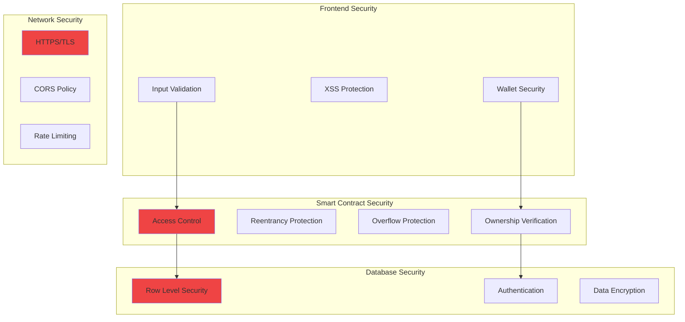
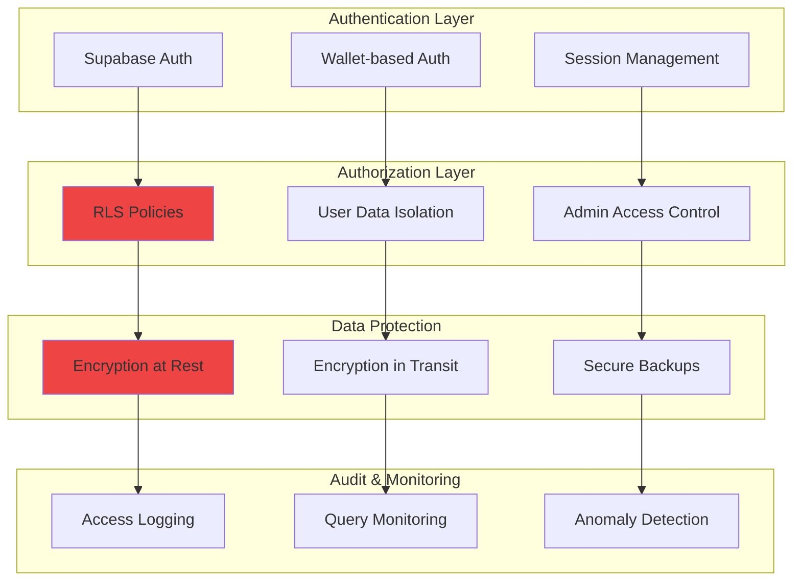
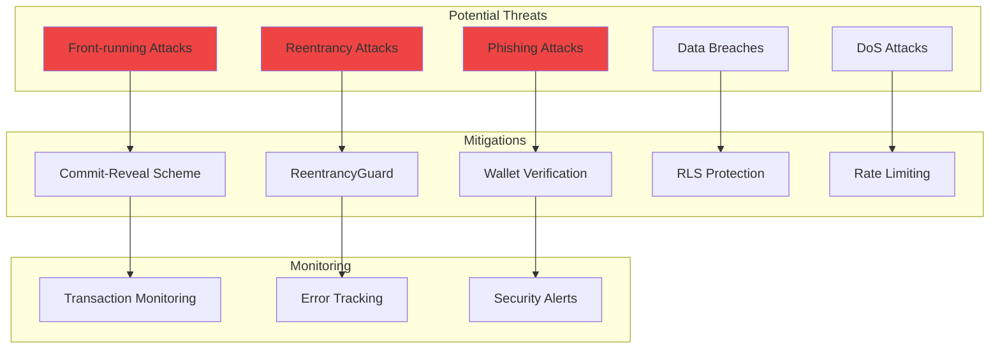
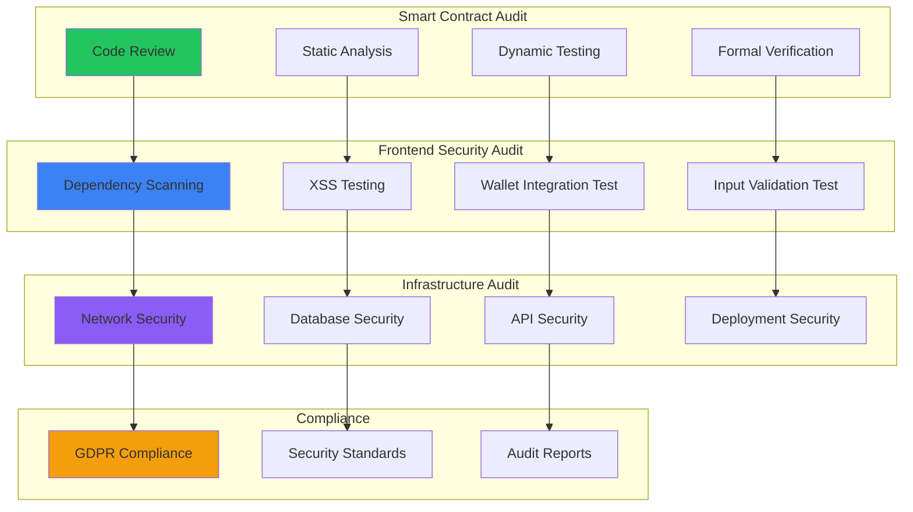

# Credit Name Service - Security Architecture

## Security Layers Overview



## Smart Contract Security Model

```mermaid
flowchart TD
    subgraph "Access Control Patterns"
        OWNER_ONLY[onlyOwner Modifier]
        MARKETPLACE_ONLY[onlyMarketplace Modifier]
        DOMAIN_OWNER[Domain Owner Check]
    end
    
    subgraph "Protected Functions"
        WITHDRAW[withdraw()]
        SET_MARKETPLACE[setMarketplace()]
        MARKET_TRANSFER[marketTransfer()]
    end
    
    subgraph "Validation Checks"
        ADDRESS_VALID[Address Validation]
        DOMAIN_EXISTS[Domain Exists Check]
        NOT_EXPIRED[Expiration Check]
        SUFFICIENT_FUNDS[Balance Check]
    end
    
    subgraph "Security Measures"
        REENTRANCY_GUARD[ReentrancyGuard]
        SAFE_MATH[SafeMath Operations]
        EVENT_LOGGING[Event Logging]
    end
    
    OWNER_ONLY --> WITHDRAW
    OWNER_ONLY --> SET_MARKETPLACE
    MARKETPLACE_ONLY --> MARKET_TRANSFER
    
    ADDRESS_VALID --> DOMAIN_OWNER
    DOMAIN_EXISTS --> NOT_EXPIRED
    NOT_EXPIRED --> SUFFICIENT_FUNDS
    
    REENTRANCY_GUARD --> SAFE_MATH
    SAFE_MATH --> EVENT_LOGGING
    
    style OWNER_ONLY fill:#ef4444
    style REENTRANCY_GUARD fill:#ef4444
```

## Database Security Architecture



## Threat Model & Mitigations



## Security Audit Checklist

