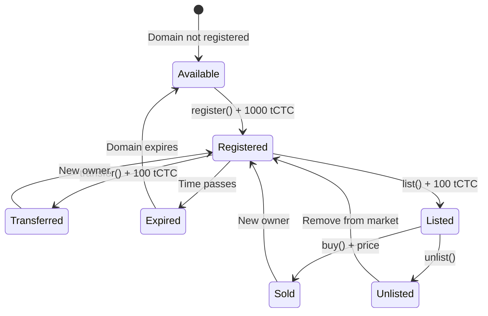
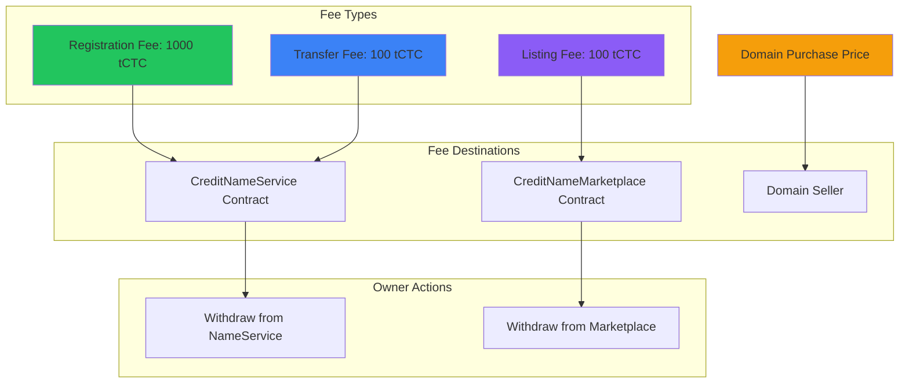

# Credit Name Service - Smart Contract Architecture

## Contract Interaction Diagram

```mermaid
graph TB
    subgraph "User Interactions"
        USER[User Wallet]
        FRONTEND[Frontend App]
    end
    
    subgraph "Smart Contracts"
        CNS[CreditNameService]
        CMP[CreditNameMarketplace]
    end
    
    subgraph "Contract Functions"
        subgraph "CreditNameService Functions"
            REG[register()]
            TRANS[transfer()]
            RENEW[renew()]
            OWNER[ownerOf()]
            MARKET_TRANS[marketTransfer()]
        end
        
        subgraph "CreditNameMarketplace Functions"
            LIST[list()]
            UNLIST[unlist()]
            BUY[buy()]
            WITHDRAW[withdraw()]
        end
    end
    
    USER --> FRONTEND
    FRONTEND --> CNS
    FRONTEND --> CMP
    
    CNS --> REG
    CNS --> TRANS
    CNS --> RENEW
    CNS --> OWNER
    CNS --> MARKET_TRANS
    
    CMP --> LIST
    CMP --> UNLIST
    CMP --> BUY
    CMP --> WITHDRAW
    
    CMP --> MARKET_TRANS
    
    style CNS fill:#3b82f6
    style CMP fill:#8b5cf6
    style USER fill:#22c55e
```

## Contract State Management



## Fee Structure Diagram



## Contract Security Model

```mermaid
flowchart TD
    subgraph "Access Control"
        OWNER[Contract Owner]
        MARKETPLACE[Marketplace Contract]
        USERS[Regular Users]
    end
    
    subgraph "Protected Functions"
        SET_MARKET[setMarketplace()]
        WITHDRAW_NS[withdraw() - NameService]
        WITHDRAW_MP[withdraw() - Marketplace]
        MARKET_TRANSFER[marketTransfer()]
    end
    
    subgraph "Public Functions"
        REGISTER[register()]
        TRANSFER[transfer()]
        LIST[list()]
        BUY[buy()]
        VIEW[View functions]
    end
    
    OWNER --> SET_MARKET
    OWNER --> WITHDRAW_NS
    OWNER --> WITHDRAW_MP
    
    MARKETPLACE --> MARKET_TRANSFER
    
    USERS --> REGISTER
    USERS --> TRANSFER
    USERS --> LIST
    USERS --> BUY
    USERS --> VIEW
    
    style OWNER fill:#ef4444
    style MARKETPLACE fill:#8b5cf6
    style USERS fill:#22c55e
```