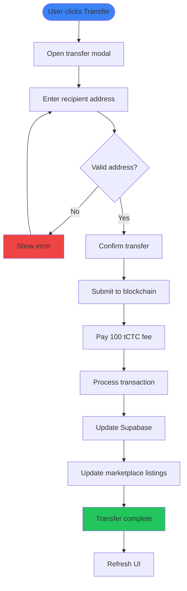
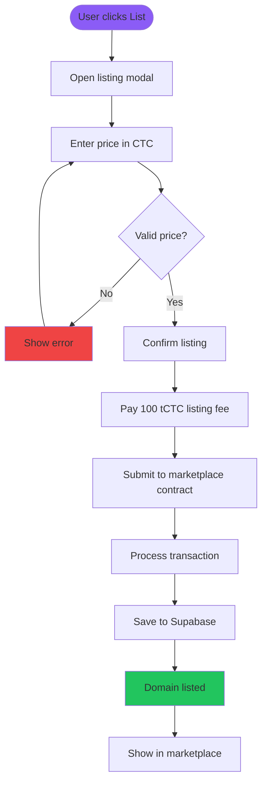

# Credit Name Service - User Flow Diagrams

## Domain Registration Flow

```mermaid
flowchart TD
    START([User visits app]) --> CONNECT{Wallet connected?}
    CONNECT -->|No| WALLET[Connect Wallet via RainbowKit]
    CONNECT -->|Yes| SEARCH[Enter domain name]
    WALLET --> NETWORK{On Credit Testnet?}
    NETWORK -->|No| SWITCH[Switch to Credit Testnet]
    NETWORK -->|Yes| SEARCH
    SWITCH --> SEARCH
    
    SEARCH --> CHECK[Check availability]
    CHECK --> AVAILABLE{Domain available?}
    AVAILABLE -->|No| TAKEN[Show "Domain taken"]
    AVAILABLE -->|Yes| REGISTER[Show register button]
    TAKEN --> SEARCH
    
    REGISTER --> PAY[Pay 1000 tCTC]
    PAY --> TX[Submit transaction]
    TX --> CONFIRM[Wait for confirmation]
    CONFIRM --> SUCCESS[Domain registered]
    SUCCESS --> PROFILE[Show in profile]
    
    style START fill:#22c55e
    style SUCCESS fill:#22c55e
    style TAKEN fill:#ef4444
```

## Domain Transfer Flow



## Marketplace Listing Flow



## Domain Purchase Flow

```mermaid
flowchart TD
    START([User clicks Buy Now]) --> CHECK{Own domain?}
    CHECK -->|Yes| ERROR[Show "Your Listing"]
    CHECK -->|No| CONFIRM[Confirm purchase]
    ERROR --> END([End])
    
    CONFIRM --> PAY[Pay listing price]
    PAY --> BLOCKCHAIN[Submit to marketplace]
    BLOCKCHAIN --> TRANSFER[Transfer domain ownership]
    TRANSFER --> PAYMENT[Send payment to seller]
    PAYMENT --> UPDATE_DB[Update database]
    UPDATE_DB --> SUCCESS[Purchase complete]
    SUCCESS --> PROFILE[Show in buyer's profile]
    
    style START fill:#8b5cf6
    style SUCCESS fill:#22c55e
    style ERROR fill:#ef4444
```